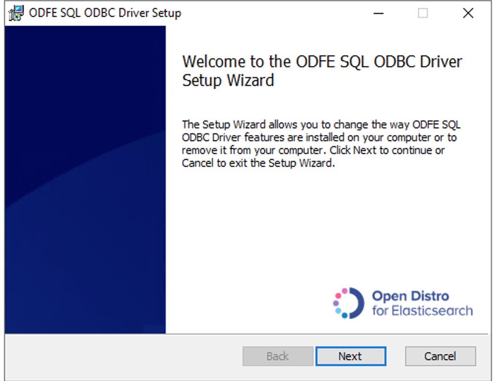
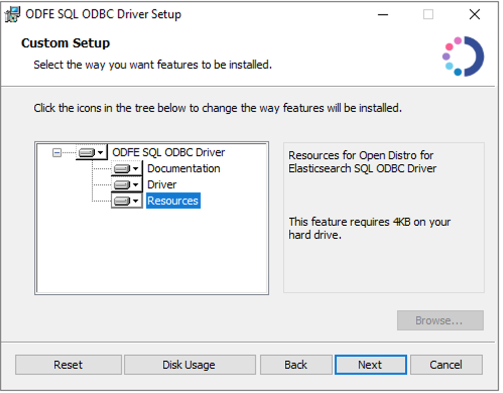
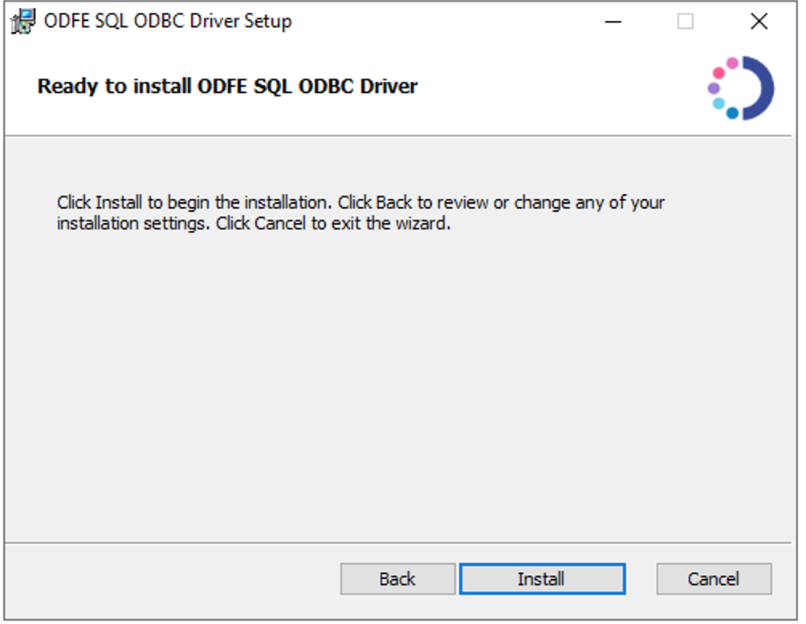
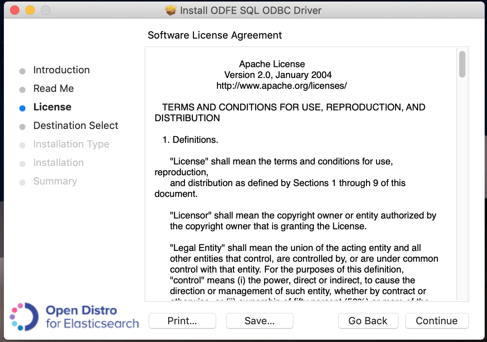
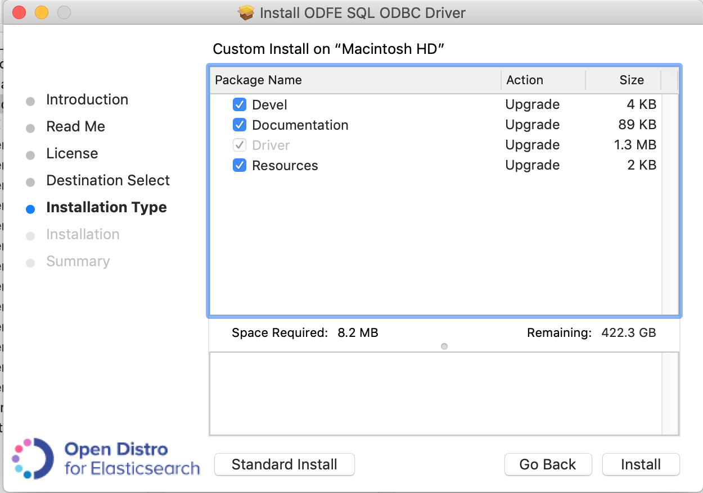
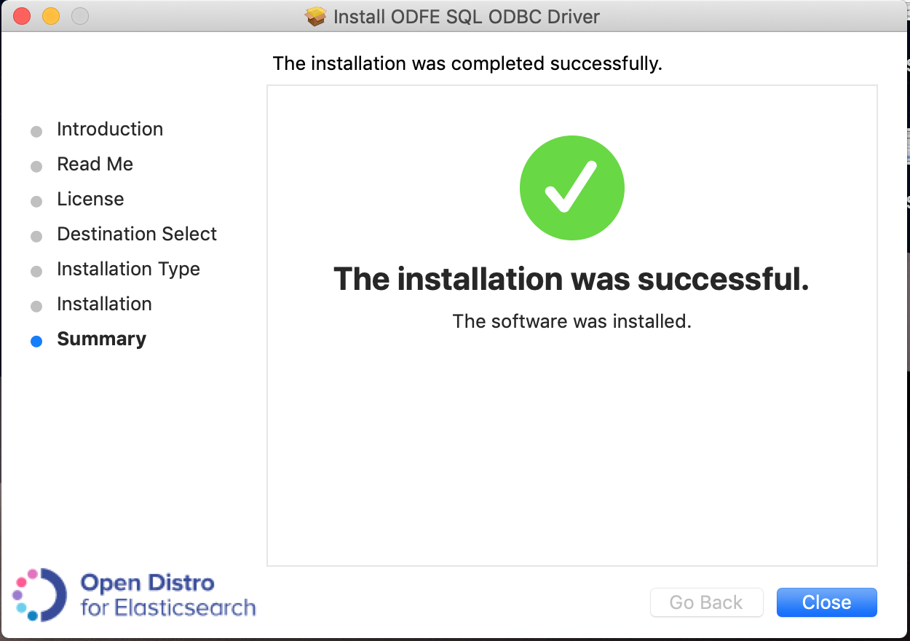

The Open Database Connectivity (ODBC) driver lets you integrate Open Distro for Elasticsearch with your favorite business intelligence (BI) applications.

The driver is currently supported for MacOS and Windows platform. The lastest version of driver is compatible with ODBC 3.51 specification.

## Driver Installation

The driver can be obtained by downloading the bundled distribution installer from [here](https://opendistro.github.io/for-elasticsearch/downloads.html) or by building from source.

###  Using Installer

#### Windows

1. Double click the downlaoded `ODFE SQL ODBC Driver-<version>-Windows.msi` installer. Click **Next**.

2. Accept the agreement and click **Next**.

3. The installer comes bundled with documentation and useful resources files to connect with various BI tools, for example `.tdc` file for Tableau. You can choose to keep the documentation and resources, or remove it. You can also choose the download location. Click **Next**.

4. Click **Install** and then **Finish**.

5. The **DSN** come already setup with the installation. The following connection information is setup as part of default DSN

//TODO; add config

#### MacOS

1. Double click the downlaoded `ODFE SQL ODBC Driver-<version>-Darwin.pkg` installer. Click **Continue**.

2. Click **Continue** to move past the **Introduction** and **Readme** .

3. Accept the agreement and click **Continue**.

4. Choose **Destination** to install driver files.

5. The installer comes bundled with documentation and useful resources files to connect with various BI tools, for example `.tdc` file for Tableau. You can choose to keep the documentation and resources, or remove it. Click **Customize** to choose need files. Click **Continue**.

4. Click **Install** and then **Close**.

5. Currently the **DSN** is not setup as part of installation and need to be configured manually.

### Connecting to Tableau

Pre-requisites:

- Make sure DSN is already setup.
- Make sure Elasticsearch is running on _host_ and _port_ as configured in DSN.
- Make sure the `.tdc` is copied to `<user_home_directory>/Documents/My Tableau Repository/Datasources` in both MacOS and Windows.

1. Start Tableau. Under **Connect** section , go to **To a Server** and choose **Other Databases (ODBC)**.

// TODO: add image

2. Once connected, you will directed to  **Datasource** window. The _Database_ will be already populated with name of Elasticsearch cluster.
To list all the indices, click the search icon under _Table_. \

// TODO: add image

3. Start playing with data by dragging table to connection area. Click **Update Now** or **Automatically Update** to populate table data.

// TODO: add image

### Connecting to Excel

Pre-requisites:

- Make sure DSN is already setup.
- Make sure Elasticsearch is running on _host_ and _port_ as configured in DSN
- Make sure the `.tdc` is copied to `<user_home_directory>/Documents/My Tableau Repository/Datasources` in both MacOS and Windows.

## Concepts

 |      |   |
 | ------------- |-------------|
 |  DSN    | A Data Source Name is used to store driver information in the system. By storing the information in the system, the information does not need to be specified each time the driver connects. |
 |  `.tdc` file    | The TDC file contains configuration information that Tableau applies to any connection matching the database vendor name and driver name defined in the file. This configuration allows customers to fine-tune parts of their ODBC data connection, turn on/off certain features not supported by data source|
